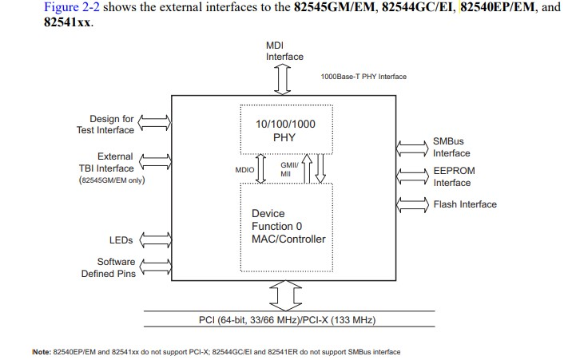
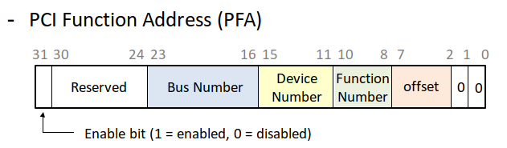
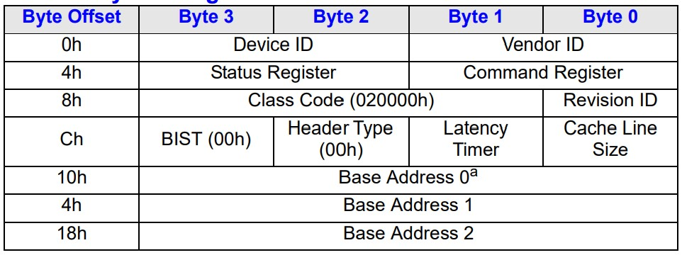
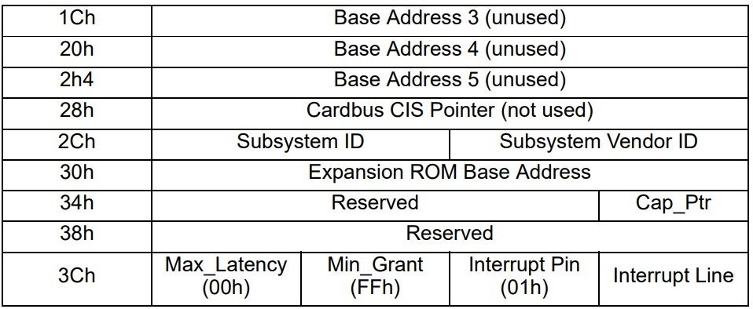

# xv6-riscv 改进：网络系统

## E1000 部分

E1000 是 QEMU 模拟出来的网卡，具体来说对应着 https://pdos.csail.mit.edu/6.828/2021/readings/8254x_GBe_SDM.pdf 中的 82540EM 网卡。

以下是这个网卡的结构图：

https://www.intel.cn/content/www/cn/zh/support/articles/000005480/ethernet-products.html

### 初始化

#### PCI 初始化

首先，E1000 网卡是 PCI 设备，通过 PCI 的主线与其他设备以及 CPU 等相连接。因此，初始化的第一步是在 PCI 总线上寻找 E1000 网卡。

PCI 总线地址的结构如下图所示：

我们遍历总线上连接的所有设备，寻找到的文件头如下所示：

通过判断偏移位置最开始的 32 位存储的内容来判断这个设备的编号，`[100e:8086]` 就是 E1000 网卡的识别号。

随后设置 BAR 寄存器初始值后，我们会调用 `e1000init` 函数转入 `e1000.c` 对网卡设备初始化。

#### E1000 初始化

在函数 `e1000init` 中，我们进行以下操作：
1. 重置设备，关闭中断
2. 对传输所用的寄存器、传输环初始化（Transmit initialization）
3. 对接收所用的寄存器、接收环初始化（Receive initialization）
4. 设置 E1000 网卡的 MAC 地址
5. 设置一个空的组播表（Multicast Table）
6. 设置网卡控制寄存器的控制位
7. 开启 E1000 中断，设置接收到每个包都触发中断

## 驱动程序

在 `e1000.c` 中，程序会直接与网卡进行交互。

上层的程序（网络层以及 ARP）会调用 `e1000_transmit` 传输包，而 e1000 的网卡通过中断，在接受包的时候会调用 `e1000_recv` 收取包，并进一步调用上层程序处理网络包的函数

传输包给网卡的 `e1000_transmit` 函数会在传输环尾指针位置放置缓冲区的包，然后调整尾指针，将包传输给网卡。

从网卡中读取包的 `e1000_recv` 函数会读取所有的并非硬件正在占据的包，并调用 `nex_rx` 函数在链路层和网络层接收包。

## 链路层：Ethernet/ARP 部分

主要代码在 `net.c`

## 网络层：IP 部分

## 运输层：UDP/ICMP 

### ICMP 协议

需要在宿主机中运行 `sudo sysctl -w net.ipv4.ping_group_range='0 2147483647'` 命令来使得 qemu 可以进行 ICMP 请求

### UDP 协议

## 用户接口：socket 部分与系统调用

仿照 Linux 的布置，我们将套接字拆分为两个部分：`socket` 和 `sock`。

这两部分的主要区别是：
+ socket 部分面向用户，负责向外提供接口。
+ sock 部分面向系统底层，负责收发和数据管理。

这样拆分的好处是可以轻易地增加协议，可扩展性很好。将来的同学写 TCP 的时候或许就不会非常的难受。

### socket 部分

### sock 部分

### 中间连接：proto 部分

https://www.cnblogs.com/zszmhd/archive/2012/05/08/2490105.html