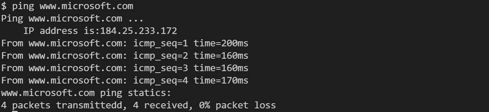

# xv6-riscv 改进：网络系统

## 网卡硬件-初始化

E1000 是 QEMU 模拟出来的网卡，具体来说对应着 https://pdos.csail.mit.edu/6.828/2021/readings/8254x_GBe_SDM.pdf 中的 82540EM 网卡。

以下是这个网卡的结构图：

### PCI 初始化

首先，E1000 网卡是 PCI 设备，通过 PCI 的主线与其他设备以及 CPU 等相连接。因此，初始化的第一步是在 PCI 总线上寻找 E1000 网卡。

PCI 总线地址的结构如下图所示：

我们遍历总线上连接的所有设备，寻找到的文件头如下所示：

通过判断偏移位置最开始的 32 位存储的内容来判断这个设备的编号，`[100e:8086]` 就是 E1000 网卡的识别号。

随后设置 BAR 寄存器初始值后，我们会调用 `e1000init` 函数转入 `e1000.c` 对网卡设备初始化。

### E1000 初始化

在函数 `e1000init` 中，我们进行以下操作：
1. 重置设备，关闭中断
2. 对传输所用的寄存器、传输环初始化（Transmit initialization）
3. 对接收所用的寄存器、接收环初始化（Receive initialization）
4. 设置 E1000 网卡的 MAC 地址
5. 设置一个空的组播表（Multicast Table）
6. 设置网卡控制寄存器的控制位
7. 开启 E1000 中断，设置接收到每个包都触发中断

## 驱动程序

在 `e1000.c` 中，程序会直接与网卡进行交互。

上层的程序（网络层以及 ARP）会调用 `e1000_transmit` 传输包，而 e1000 的网卡通过中断，在接受包的时候会调用 `e1000_recv` 收取包，并进一步调用上层程序处理网络包的函数。

传输包给网卡的 `e1000_transmit` 函数会在传输环尾指针位置放置缓冲区的包，然后调整尾指针，将包传输给网卡。

从网卡中读取包的 `e1000_recv` 函数会读取所有的并非硬件正在占据的包，并调用 `nex_rx` 函数在链路层和网络层接收包。

## 基本网络协议

这里构造了一个结构体 `mbuf`，作为“包”的物理载体。`mbuf` 会将“包”的数据放在中间，头和尾空出来一定的大小（不小于128字节）用于放置协议头和协议尾。

下面的各层都以 `mbuf` 作为基本的传送单位，主要代码均在 `net.c` 中。这里并非操作系统的主要内容，就简要阐释。

### 链路层：Ethernet/ARP 部分

接收：

e1000 接收到一个包，中断处理程序会调用 `net_rx` 函数。在这个函数中，程序会脱去 Ethernet 的头部，并根据是 `ip` 协议还是 `arp` 协议，选择调用 `net_rx_ip` 和 `net_rx_arp` 进行进一步的处理。

发送：

由于我们对 ARP 协议的支持不够全面，我们目前的以太网包是通过广播的形式发送，也就是目标 MAC 地址为 `FF:FF:FF:FF:FF:FF` 。

### 网络层：IP 部分

接收：链路层调用的 `net_rx_ip` 函数中，程序会脱去 IP 协议的头部，根据对应的运输层协议转入不同的函数进行处理。

发送：在 `net_tx_ip` 中，根据目的地附加上 IP 协议头，然后交给 `net_tx_eth` 。

### 运输层：UDP/ICMP 

接收：

IP 协议检测到是 UDP/ICMP 运输层协议的话，就会调用对应的 `net_rx_udp`/`net_rx_icmp` 接收包，随后调用 `sockrecvudp` / `sockrecvicmp` ，转入套接字处理，唤醒发出这个包的 sock 。

发送：

当套接字将要发送 UDP/ICMP 包时，就会调用 `net_tx_udp`/`net_tx_icmp`，该函数根据调用信息在包前面附上 UDP/ICMP 头之后，转入 `net_tx_ip` 处理。

注意：需要在宿主机中运行 `sudo sysctl -w net.ipv4.ping_group_range='0 2147483647'` 命令来使得 qemu 模拟的网络可以进行 ICMP 请求。

## 用户接口：socket 部分与系统调用

主要代码在 `sock.c`。

我们将网络作为一种特殊的文件，赋予其 `FD_SOCK` 的“文件类型”，并且将其读写纳入 `read` 和 `write` 的统一处理。

同时，我们还创建了 `connect` 的系统调用，用于新建一个套接字通讯接口（对 UDP，对 ICMP 是 `connect_icmp`）。

发送：

在 `sockwrite` 函数中，如果 sock 采用的是 UDP，就会调用 `net_tx_udp` 函数；如果是 ICMP，则会采用 `net_tx_icmp` 命令。

接收:

接收采用的是中断阻塞的方式。某个 `sock` 在调用 `read` 后，会查看是否有可以取出来的包。如果有，就拆出来包的内容，放到 `read` 给出的 `buf` 中；如果没有，就进入阻塞状态，等待运输层的唤醒。

## 实现用户命令

### DNS ：nslookup

这个命令可以证明我们的 UDP 模块是正常工作的。

使用方法：`nslookup target_name`

使用截图：

### PING ：ping

这个命令可以证明我们的 ICMP 模块是正常工作的。

使用方法：`ping target_name`

支持 ip 地址，也支持域名（会先进行一次 dns 解析）。

使用截图：

## 难点、创新点

1. 设备的硬件手册非常 *n 难读
    + Intel 的网卡手册只有英文，而且总共有400页
	+ 涉及到了课堂没有讲到的 buffer ring 机制
2. 网络协议纷繁复杂
	+ 总共实现了四个协议（Ethernet，IP，UDP，ICMP），还有用户层面的套接字
3. 对操作系统知识要求综合
	+ 需要同时实现：系统调用的增加、中断处理、总线寻址与设备初始化、用户命令

## 分工

+ 陈启乾：整体架构搭建 + E1000 驱动
+ 周雅琪：ARP + IP
+ 冯俊博：ICMP + UDP 
+ 朱俊：内核套接字系统调用、用户模式下的套接字接口与命令

## 参考资料

https://www.cnblogs.com/zszmhd/archive/2012/05/08/2490105.html

https://www.intel.cn/content/www/cn/zh/support/articles/000005480/ethernet-products.html

https://pdos.csail.mit.edu/6.828/2020/labs/net.html
